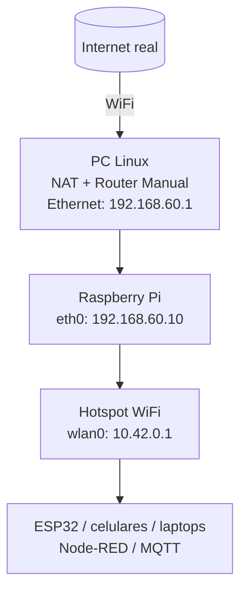

#  README – Arquitectura de Red Raspberry Pi + Hotspot + Internet desde PC + Node-RED

Este documento resume **todo el proceso real** que configuramos:

- Cómo la Raspberry recibe **Internet desde tu PC** por Ethernet  
- Cómo la Raspberry crea un **Hotspot WiFi estable (AP)**  
- Cómo conectar **ESP32 + Node-RED + Mosquitto MQTT**  
- Qué revisar cuando algo falle  
- Cómo migrarlo a otros PC sin perder nada  

---
Para ingresar por ethernet
   - arp -a
   - la direccion qeu salga ssh pi4@192.###....


# 1. Arquitectura General



---

# 2. Configuración del PC (Linux)

<details>
<summary><strong> 2.1 Asignar IP fija al PC (actúa como router)</strong></summary>

```bash
nmcli connection add type ethernet ifname <interfaz_usb_eth> \
con-name rpi-static ipv4.method manual \
ipv4.addresses 192.168.60.1/24 ipv6.method ignore

nmcli connection up rpi-static
```

Revisar:

```bash
ip a show <interfaz_usb_eth>
```

Debe mostrar:

```
inet 192.168.60.1/24
```

</details>

---

<details>
<summary><strong> 2.2 Habilitar NAT (para que la Raspberry reciba Internet)</strong></summary>

```bash
sudo sysctl -w net.ipv4.ip_forward=1
```

```bash
sudo iptables -t nat -A POSTROUTING -o wlp2s0 -j MASQUERADE
sudo iptables -A FORWARD -i wlp2s0 -o <interfaz_usb_eth> -m state --state RELATED,ESTABLISHED -j ACCEPT
sudo iptables -A FORWARD -i <interfaz_usb_eth> -o wlp2s0 -j ACCEPT
```

Esto convierte tu PC en un **router**.

</details>

---

<details>
<summary><strong> 2.3 Si cambias de PC → qué repetir</strong></summary>

Debes repetir SOLO esto:

- asignar IP fija al nuevo PC → `192.168.60.1`
- habilitar IP forwarding
- crear reglas NAT

El resto **no se toca**.

</details>

---

<details>
<summary><strong> 2.4 ¿Por qué usamos IP fija?</strong></summary>

Una IP fija garantiza que Raspberry ↔ PC siempre se encuentren.

- El PC es **gateway** → debe ser estable
- La Raspberry necesita **ruta fija**
- MQTT, SSH y Node-RED dependen de IPs previsibles
- No hay servidor DHCP en este esquema

**IP fija = sistema estable y reproducible.**

</details>

---

<details>
<summary><strong> 2.5 ¿Qué es Reverse Tethering?</strong></summary>

```text
PC (WiFi con Internet)
↓
PC (router + NAT manual)
↓ Ethernet
Raspberry Pi (cliente)
↓
Hotspot WiFi (LAN local)
↓
ESP32 / Node-RED / celulares / laptop
```

Ventajas:

- No necesitas router externo  
- Control total del tráfico  
- Raspberry tiene Internet aunque no tenga WiFi propio  
- Ideal para proyectos IoT móviles o de laboratorio  

</details>

---

# 3. Configuración de la Raspberry Pi

<details>
<summary><strong> 3.1 IP estática en eth0</strong></summary>

```bash
sudo nmcli connection modify eth0-static \
ipv4.method manual \
ipv4.addresses 192.168.60.10/24 \
ipv4.gateway 192.168.60.1 \
ipv4.dns "8.8.8.8 1.1.1.1"

sudo nmcli connection down eth0-static
sudo nmcli connection up eth0-static
```

</details>

---

<details>
<summary><strong> 3.2 Ruta por defecto</strong></summary>

```bash
ip r
```

Debe mostrar:

```
default via 192.168.60.1 dev eth0
```

Si no:

```bash
sudo ip route replace default via 192.168.60.1 dev eth0
```

</details>

---

<details>
<summary><strong> 3.3 Probar Internet</strong></summary>

```bash
ping 8.8.8.8
curl google.com
```

</details>

---

# 4. Crear el hotspot con NetworkManager

<details>
<summary><strong> 4.1 Crear el hotspot WiFi</strong></summary>

```bash
sudo nmcli connection add type wifi ifname wlan0 \
con-name hotspot autoconnect yes ssid "RPi-Hotspot"

sudo nmcli connection modify hotspot \
802-11-wireless.mode ap \
802-11-wireless.band bg \
wifi-sec.key-mgmt wpa-psk \
wifi-sec.psk "12345678" \
ipv4.method shared

sudo nmcli connection up hotspot
```

</details>

---

<details>
<summary><strong> 4.2 ¿Qué hace NetworkManager?</strong></summary>

- Asigna `10.42.0.1` a wlan0  
- Inicia DHCP + DNS automáticamente  
- Activa NAT wlan0 ↔ eth0  
- Mantiene el AP encendido aunque no haya Internet  

</details>

---

<details>
<summary><strong> 4.3 Dispositivos conectados al hotspot</strong></summary>

- **SSID:** `RPi-Hotspot`
- **Clave:** `12345678`
- IP Raspberry: `10.42.0.1`
- Node-RED: `http://10.42.0.1:1880`

</details>

---

# 5. Node-RED en la Raspberry

<details>
<summary><strong> 5.1 Acceso desde PC</strong></summary>

```
http://192.168.60.10:1880
```

</details>

---

<details>
<summary><strong> 5.2 Acceso desde hotspot</strong></summary>

```
http://10.42.0.1:1880
```

</details>

---

<details>
<summary><strong> 5.3 Comandos útiles</strong></summary>

```bash
sudo systemctl status nodered
sudo systemctl restart nodered
node-red-start
node-red-log
```

</details>

---

# 6. Node-RED + Mosquitto MQTT

<details>
<summary><strong> 6.1 Instalar Node-RED</strong></summary>

```bash
bash <(curl -sL https://raw.githubusercontent.com/node-red/linux-installers/master/deb/update-nodejs-and-nodered)
sudo systemctl enable nodered
sudo systemctl start nodered
```

</details>

---

<details>
<summary><strong> 6.2 Instalar Mosquitto</strong></summary>

```bash
sudo apt update
sudo apt install mosquitto mosquitto-clients
sudo systemctl enable mosquitto
sudo systemctl start mosquitto
```

</details>

---

<details>
<summary><strong> 6.3 Arquitectura MQTT</strong></summary>

```
ESP32 → Mosquitto → Node-RED → Dashboard
```

IP del broker:

| Conexión ESP32  | Broker        |
|-----------------|---------------|
| Hotspot         | 10.42.0.1     |
| Ethernet PC→RPI | 192.168.60.10 |

</details>

---

# 7. Conexión de ESP32

<details>
<summary><strong> 7.1 ESP32 por Hotspot</strong></summary>

```c
client.setServer("10.42.0.1", 1883);
```

</details>

---

<details>
<summary><strong> 7.2 ESP32 conectado al PC</strong></summary>

```c
client.setServer("192.168.60.10", 1883);
```

</details>

---

<details>
<summary><strong> 7.3 Varios ESP32 al mismo tiempo</strong></summary>

Broker común:

```
10.42.0.1:1883
```

Requisitos:

- clientID únicos  
- topics organizados  

</details>

---

# 8. Solución de problemas

<details>
<summary><strong> 8.1 Raspberry sin Internet</strong></summary>

```bash
ip r
```

Debe verse:

```
default via 192.168.60.1 dev eth0
```

</details>

---

<details>
<summary><strong> 8.2 Hotspot sin Internet</strong></summary>

```bash
sudo iptables -t nat -L -n -v
```

Debe existir MASQUERADE.

</details>

---

<details>
<summary><strong> 8.3 ESP32 no conecta</strong></summary>

- Verificar IP  
- Puerto 1883  
- ClientID no duplicado  

</details>

---

<details>
<summary><strong> 8.4 Node-RED no abre</strong></summary>

```bash
curl http://localhost:1880
sudo systemctl restart nodered
```

</details>

---

# 9. Arquitectura Final Estable

```text
PC Linux (router)
  ├─ WiFi → Internet
  └─ Ethernet 192.168.60.1 → NAT

Raspberry Pi
  ├─ eth0: 192.168.60.10 (WAN)
  ├─ wlan0 Hotspot: 10.42.0.1 (LAN)
  ├─ Node-RED :1880
  └─ Broker MQTT Mosquitto

Dispositivos
  └─ ESP32 / celulares → 10.42.0.x → Node-RED / MQTT / Internet
```

---


